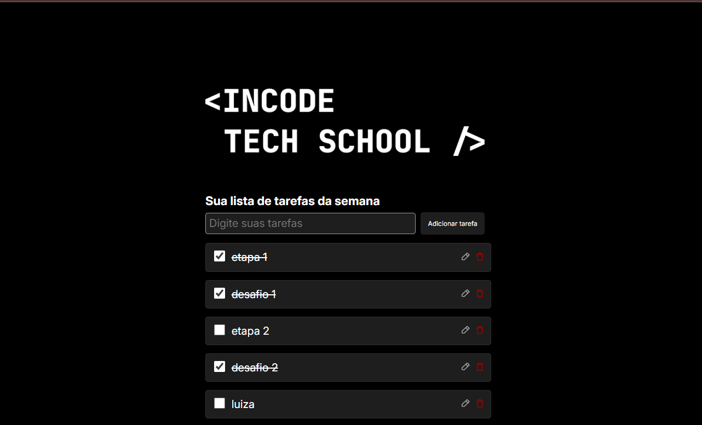

#  📎desafio2 frontend incode  
---

  

[Sobre](#hippopotamus-sobre) • [Demonstração](#desktop_computer-demonstração) • [Construido com](#rocket-Desenvolvido-com)
 • [Protótipo](#jigsaw-protótipo) • [Como executar](#bulb-como-executar) • [Autora](#star-autores) 

 
---

### 💾: Sobre
Segundo desafio da trilha de front-end do Incode Tech School, a criação de uma task-list a partir de um protótipo utilizando majoritariamente javascript. Para testar meus conhecimentos sobre Javascript.

---

### :desktop_computer: Demonstração

Atráves [deste link]([https://luizabelfort.github.io/desafio1_frontend_incode/](https://luizabelfort.github.io/desafio-2---FrontEnd-Incod/)) é possível acessar a página de demonstração do projeto no GitHub Pages

---

### :rocket: Desenvolvido com

O Projeto foi desenvolvido utilizando as seguintes tecnologias e ferramentas

- VSCode
- HTML
- CSS
- JAVASCRIPT
---

### :jigsaw: Protótipo

O protótipo da interface foi criado inicialmente utilizando o Figma, é possível acessa-lo através [deste link]([https://www.figma.com/design/iW5CDR0BgGKDQ77m3fqxBQ/Desafios-INCODE?node-id=0-1&t=D2aIPE5LzjgQxl2B-1](https://www.figma.com/design/bss3TXXRhn5pVs7lMZHtwR/INCODE-M3-REACT?node-id=1-5&t=7xRP2U0vlFwjwVtM-1)).

---

### :bulb: Como executar

Para visualizar o projeto localmente, basta clonar este repositório e abrir o arquivo [index.html](./index.html) em seu navegador.

---

### 💾 Autora 

<table>
  <tr>
    <td align="center">
      <a href="https://github.com/Luizabelfort" title="defina o titulo do link">
         
        
          <b>Luiaz Belfort</b>
        
      </a>
    </td>
   
  </tr>
</table>

---
